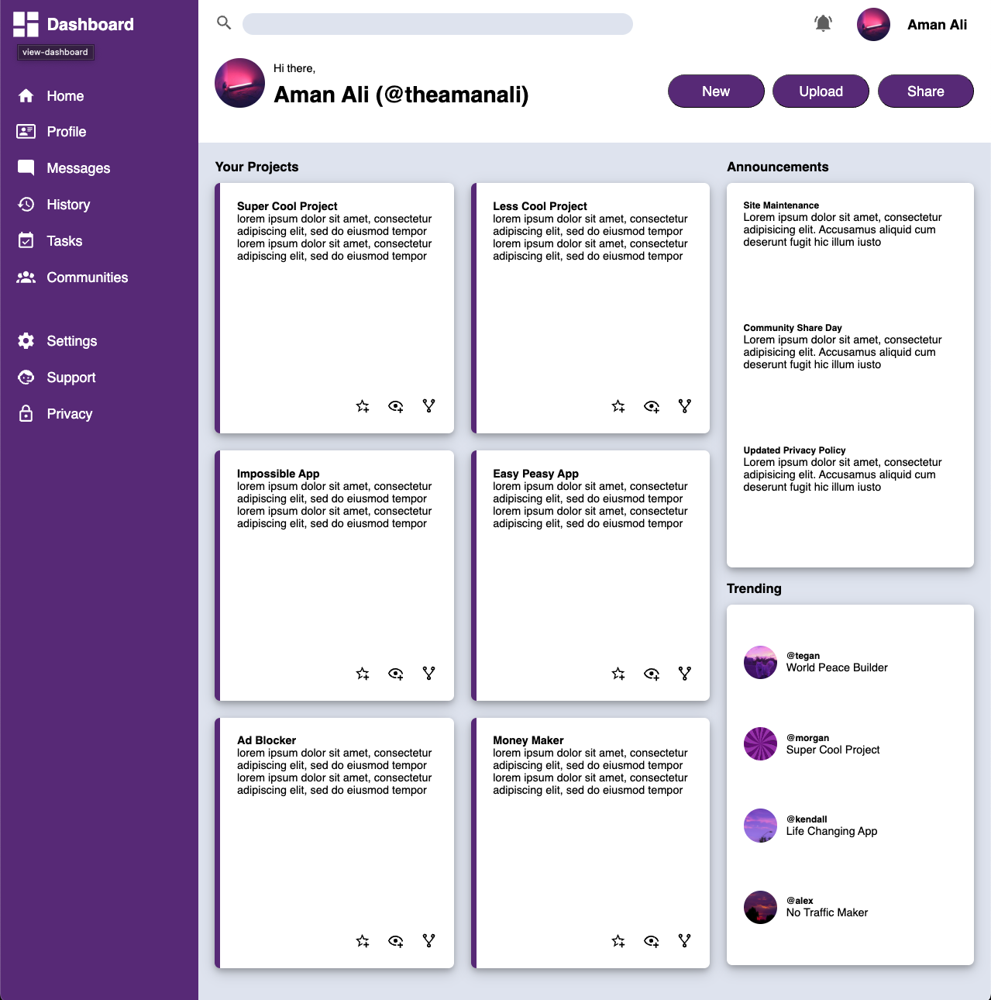

# Admin Dashboard 📊
A full admin dashboard built with semantic HTML and modern CSS as part of The Odin Project’s Intermediate HTML and CSS course. The layout is driven primarily by CSS Grid and demonstrates practical front-end layout techniques.

---

## 🚀 Try it out


[🔗 View Live](https://theamanali.github.io/admin-dashboard)

---

## ✨ Features
- Full dashboard layout: sidebar, header, and main content area
- Responsive layout using **CSS Grid** (with some Flexbox where needed)
- Nested grids to organize sections like:
    - Navigation & branding
    - Search bar & user info
    - Project cards, announcements, and trending users
- Custom icons and placeholder content
- Google Fonts integration (`Roboto`)

To add:
- Responsiveness for mobile layouts
- Dark mode toggle

---

## 🛠️ Installation
To run locally:

```bash
git clone git@github.com:theamanali/admin-dashboard.git
cd admin-dashboard
open index.html
```
Or simply open index.html in your browser after downloading or cloning the repo.

---

## 🧰 Technologies Used
- **HTML5** – Semantic structure and accessibility
- **CSS3**
    - Grid Layout
    - Flexbox for component-level layout
    - Custom variables and utility classes
- **Google Fonts** – [Roboto](https://fonts.google.com/specimen/Roboto)
- **Material Design Icons** – SVG icon assets

---

## 🌄 Image Credits
- [Purple Cat – Reddit](https://www.reddit.com/r/cat/comments/mbmbky/purple/)
- [Purple Swirl Background – Creative Fabrica](https://www.creativefabrica.com/product/purple-swirl-background-2/)
- [Street Light – Unsplash (W1fZKMIlkpM)](https://unsplash.com/photos/black-street-light-under-purple-sky-W1fZKMIlkpM)
- [Sunset Over Trees – Unsplash (WoIFB4L1Bzs)](https://unsplash.com/photos/the-sun-is-setting-over-the-trees-in-the-distance-WoIFB4L1Bzs)

---

## 📄 License
This project is licensed under the [MIT License](https://opensource.org/licenses/MIT).
